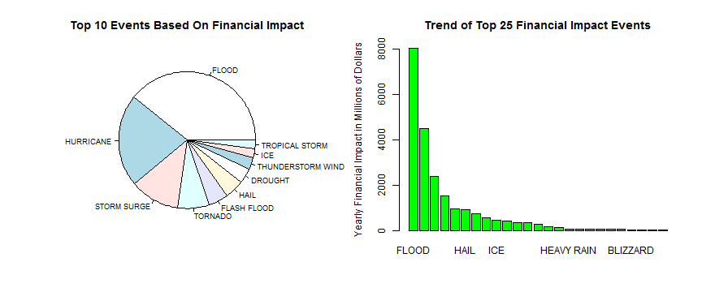

Analysis of Severe Weather Events for Impact on the Public Health and The Financial Impact of The Events
========================================================
1 January 1991 through 30 November 2011
----------------------------------------


Synopsis:
---------
This analysis was under taken utilizing the U.S. National Oceanic and Atmospheric 
Administration's National Weather Service’s storm database which contains information 
on major storms and weather events from January 1950 to November 2011, to explore 
what types of weather event have the greatest impact on human life (injuries or 
death) or financial loss. The data from this data base was processed to provide 
a less granular grouping of the events and to compute the total economic loss, 
which include both property and crop damage. For the financial impact the report 
will present a list in descending order of the events that had an average yearly 
financial impact of over $1,000,000, 000 additionally the top 20 events will be 
presented graphically. The health impacts will be presented 

Data Processing:
----------------
The supplied data file is read into R as a data frame.

```r
data <- read.csv("data/repdata-data-StormData.csv.bz2",
                 stringsAsFactors = FALSE)
```

The data frame then has a limited amout of andjustments made to it. The scope of the
changes were confined to values of interest in this study only. As such other values
were not adjusted. With the exception of the value names, these were adjected in mass
will all the names to lower case. This adjustment was made to reduce errors in
programing and processing.

The event begin date (bgn_date) as converted to to a date value and the event type
was converted to a factor. Then the number of health impacts (deaths and injuries)
as computed for each event reported. 

Next the property and crop damage multiplier
field (propdmgexp and cropdmgexp) was cleaned setting the values of H/h (hundreds) to 2,
K/k (thousands) to 3, M/m (millions) to 6, and B/b (billions) to 9, based on the
United States of America counting systems for these designations. These fields also
contained several "*strange*" characters ("+", "?", and "-" ) examining sampling of these records
provided me with the estimate that 1) there were not many records like this and 2)
that the narative or event summery provided no other information so these were set to zero
for this analysis. Finally any null or blank fields were also converted to 0. These
fields were then converted to a numeric variable.

Using the property damage (propdmg) and the propery damage multiplier the property
damage value was computed using the formula ${propcash} = {propdmg} * 10 ^ {propdmgexp}$.
The same approach was used to compute cropcash. The cropcash and propcash values
were then summed and then devided by a million (1,000,000) and called totalcash_M.


```r
names(data) <- tolower(names(data))
data$bgn_date <- as.Date(data$bgn_date,  "%m/%d/%Y")
data$evtype <- as.factor(data$evtype)
data <- cbind(data,
              data.frame(health = apply(subset(data, select = c(fatalities,
                                                                injuries)),
                                        1,
                                        sum)
                         )
              )

# make propdmgexp usable
data$propdmgexp <- sub("h", "2", data$propdmgexp, ignore.case = TRUE)
data$propdmgexp <- sub("k", "3", data$propdmgexp, ignore.case = TRUE)
data$propdmgexp <- sub("m", "6", data$propdmgexp, ignore.case = TRUE)
data$propdmgexp <- sub("b", "9", data$propdmgexp, ignore.case = TRUE)
# deal with unknown variables.
data$propdmgexp <- sub("-", "0", data$propdmgexp)
data$propdmgexp <- sub("\\?","0",data$propdmgexp)
data$propdmgexp <- sub("\\+", "0", data$propdmgexp)
data$propdmgexp <- sub("","0", data$propdmgexp)
# convert to a numeric
data$propdmgexp <- as.numeric(data$propdmgexp)
#
# make cropdmgexp usable
#
data$cropdmgexp <- sub("h", "2", data$cropdmgexp, ignore.case = TRUE)
data$cropdmgexp <- sub("k", "3", data$cropdmgexp, ignore.case = TRUE)
data$cropdmgexp <- sub("m", "6", data$cropdmgexp, ignore.case = TRUE)
data$cropdmgexp <- sub("b", "9", data$cropdmgexp, ignore.case = TRUE)
# deal with unknown variables.
data$cropdmgexp <- sub("-"  , "0", data$cropdmgexp)
data$cropdmgexp <- sub("\\+", "0", data$cropdmgexp)
data$cropdmgexp <- sub("\\?", "0", data$cropdmgexp)
data$cropdmgexp <- sub(""   , "0", data$cropdmgexp)
# convert to a numeric
data$cropdmgexp <- as.numeric(data$cropdmgexp)
#
# compute total prop and crop damages the total financial loss report for each event
#

temp <- data$propdmg * (10 ^ data$propdmgexp)
data <- cbind(data,
              data.frame(propcash = temp))
temp <- data$cropdmg * (10 ^ data$cropdmgexp)
data <- cbind(data,
              data.frame(cropcash = temp))
temp <- (data$propcash + data$cropcash)/1000000
data <- cbind(data,
              data.frame(totalcash_M = temp))
rm(temp)
```

The event type (evtype) factor variable was then cleaned up convert lower case values
to the same upper case and simular events were reassiged to a common event type,
such as "GUSTY WINDS" was converted to "WIND", all named Huricannes were converted
into a single HURICANNE entry. This was done to provide a better picture into the
cost (both human and financial) of these events.

```r
levels(data$evtype)[levels(data$evtype) == "blowing snow"] <- "BLOWING SNOW"
levels(data$evtype)[levels(data$evtype) == "Coastal Flooding"] <- "COASTAL FLOOD"
levels(data$evtype)[levels(data$evtype) == "COASTAL FLOODING"] <- "COASTAL FLOOD"
levels(data$evtype)[levels(data$evtype) == "COASTAL FLOODING/EROSION"] <- "COASTAL FLOOD"
levels(data$evtype)[levels(data$evtype) == "COASTAL STORM"] <- "COASTAL STORM"
levels(data$evtype)[levels(data$evtype) == "Coastal Storm"] <- "COASTAL STORM"
levels(data$evtype)[levels(data$evtype) == "COASTALSTORM"] <- "COASTAL STORM"
levels(data$evtype)[levels(data$evtype) == "COLD AND SNOW"] <- "COLD"
levels(data$evtype)[levels(data$evtype) == "Cold Temperature"] <- "COLD"
levels(data$evtype)[levels(data$evtype) == "COLD WAVE"] <- "COLD"
levels(data$evtype)[levels(data$evtype) == "COLD WEATHER"] <- "COLD"
levels(data$evtype)[levels(data$evtype) == "COLD/WIND CHILL"] <- "COLD"
levels(data$evtype)[levels(data$evtype) == "COLD/WINDS"] <- "COLD"
levels(data$evtype)[levels(data$evtype) == "DROUGHT/EXCESSIVE HEAT"] <- "EXCESSIVE HEAT"
levels(data$evtype)[levels(data$evtype) == "DRY MIRCOBURST WINDS"] <- "DRY MIRCOBURST"
levels(data$evtype)[levels(data$evtype) == "Dust Devil"] <- "DUST DEVIL"
levels(data$evtype)[levels(data$evtype) == "Extended Cold"] <- "EXTREME COLD"
levels(data$evtype)[levels(data$evtype) == "Extreme Cold"] <- "EXTREME COLD"
levels(data$evtype)[levels(data$evtype) == "EXTREME COLD/WIND CHILL"] <- "EXTREME COLD"
levels(data$evtype)[levels(data$evtype) == "EXTREME WINDCHILL"] <- "EXTREME COLD"
levels(data$evtype)[levels(data$evtype) == "FLASH FLOOD/FLOOD"] <- "FLASH FLOOD"
levels(data$evtype)[levels(data$evtype) == "FLASH FLOODING"] <- "FLASH FLOOD"
levels(data$evtype)[levels(data$evtype) == "FLASH FLOODING/FLOOD"] <- "FLASH FLOOD"
levels(data$evtype)[levels(data$evtype) == "FLASH FLOODS"] <- "FLASH FLOOD"
levels(data$evtype)[levels(data$evtype) == "FLOOD & HEAVY RAIN"] <- "FLOOD"
levels(data$evtype)[levels(data$evtype) == "FLOOD/FLASH FLOOD"] <- "FLOOD"
levels(data$evtype)[levels(data$evtype) == "FLOOD/RIVER FLOOD"] <- "FLOOD"
levels(data$evtype)[levels(data$evtype) == "FLOODING"] <- "FLOOD"
levels(data$evtype)[levels(data$evtype) == "FOG AND COLD TEMPERATURES"] <- "COLD"
levels(data$evtype)[levels(data$evtype) == "FREEZING RAIN/SNOW"] <- "FREEZING RAIN"
levels(data$evtype)[levels(data$evtype) == "Freezing Spray"] <- "FREEZING SPRAY"
levels(data$evtype)[levels(data$evtype) == "GLAZE/ICE STORM"] <- "ICE STORM"
levels(data$evtype)[levels(data$evtype) == "GUSTY WIND"] <- "WIND"
levels(data$evtype)[levels(data$evtype) == "GUSTY WINDS"] <- "WIND"
levels(data$evtype)[levels(data$evtype) == "Gusty winds"] <- "WIND"
levels(data$evtype)[levels(data$evtype) == "Gusty Winds"] <- "WIND"
levels(data$evtype)[levels(data$evtype) == "HEAT WAVE"] <- "HEAT"
levels(data$evtype)[levels(data$evtype) == "Heat Wave"] <- "HEAT"
levels(data$evtype)[levels(data$evtype) == "HEAT WAVE DROUGHT"] <- "HEAT"
levels(data$evtype)[levels(data$evtype) == "HEAT WAVES"] <- "HEAT"
levels(data$evtype)[levels(data$evtype) == "HEAVY RAINS"] <- "HEAVY RAIN"
levels(data$evtype)[levels(data$evtype) == "HEAVY SNOW"] <- "SNOW"
levels(data$evtype)[levels(data$evtype) == "HEAVY SNOW AND HIGH WINDS"] <- "SNOW"
levels(data$evtype)[levels(data$evtype) == "Heavy snow shower"] <- "SNOW"
levels(data$evtype)[levels(data$evtype) == "HEAVY SNOW/BLIZZARD/AVALANCHE"] <- "SNOW"
levels(data$evtype)[levels(data$evtype) == "HEAVY SNOW/ICE"] <- " SNOW"
levels(data$evtype)[levels(data$evtype) == "Heavy Surf"] <- "HEAVY SURF"
levels(data$evtype)[levels(data$evtype) == "Heavy surf and wind"] <- "HEAVY SURF"
levels(data$evtype)[levels(data$evtype) == "HEAVY SURF/HIGH SURF"] <- "HEAVY SURF"
levels(data$evtype)[levels(data$evtype) == "HIGH"] <- "WIND"
levels(data$evtype)[levels(data$evtype) == "HIGH SURF"] <- "HEAVY SURF"
levels(data$evtype)[levels(data$evtype) == "High Surf"] <- "HEAVY SURF"
levels(data$evtype)[levels(data$evtype) == "HIGH SWELLS"] <- "HEAVY SURF"
levels(data$evtype)[levels(data$evtype) == "HIGH WIND 48"] <- "HIGH WIND"
levels(data$evtype)[levels(data$evtype) == "HIGH WIND AND SEAS"] <- "HIGH WIND"
levels(data$evtype)[levels(data$evtype) == "HIGH WIND/HEAVY SNOW"] <- "HIGH WIND"
levels(data$evtype)[levels(data$evtype) == "HIGH WIND/SEAS"] <- "HIGH WIND"
levels(data$evtype)[levels(data$evtype) == "HIGH WINDS"] <- "HIGH WIND"
levels(data$evtype)[levels(data$evtype) == "HIGH WINDS/COLD"] <- "HIGH WIND"
levels(data$evtype)[levels(data$evtype) == "HIGH WINDS/SNOW"] <- "HIGH WIND"
levels(data$evtype)[levels(data$evtype) == "Hurricane Edouard"] <- "HURRICANE"
levels(data$evtype)[levels(data$evtype) == "HURRICANE EMILY"] <- "HURRICANE"
levels(data$evtype)[levels(data$evtype) == "HURRICANE ERIN"] <- "HURRICANE"
levels(data$evtype)[levels(data$evtype) == "HURRICANE FELIX"] <- "HURRICANE"
levels(data$evtype)[levels(data$evtype) == "HURRICANE OPAL"] <- "HURRICANE"
levels(data$evtype)[levels(data$evtype) == "HURRICANE OPAL/HIGH WINDS"] <- "HURRICANE"
levels(data$evtype)[levels(data$evtype) == "HURRICANE/TYPHOON"] <- "HURRICANE"
levels(data$evtype)[levels(data$evtype) == "HURRICANE-GENERATED SWELLS"] <- "HEAVY SURF"
levels(data$evtype)[levels(data$evtype) == "HYPOTHERMIA"] <- "EXTREME COLD"
levels(data$evtype)[levels(data$evtype) == "Hypothermia/Exposure"] <- "EXTREME COLD"
levels(data$evtype)[levels(data$evtype) == "HYPOTHERMIA/EXPOSURE"] <- "EXTREME COLD"
levels(data$evtype)[levels(data$evtype) == "ICE ON ROAD"] <- "ICE"
levels(data$evtype)[levels(data$evtype) == "ICE ROADS"] <- "ICE"
levels(data$evtype)[levels(data$evtype) == "ICE STORM"] <- "ICE"
levels(data$evtype)[levels(data$evtype) == "ICE STORM/FLASH FLOOD"] <- "ICE"
levels(data$evtype)[levels(data$evtype) == "ICY ROADS"] <- "ICE"
levels(data$evtype)[levels(data$evtype) == "LANDSLIDES"] <- "LANDSLIDE"
levels(data$evtype)[levels(data$evtype) == "LIGHT SNOW"] <- "SNOW"
levels(data$evtype)[levels(data$evtype) == "LIGHTNING AND THUNDERSTORM WIN AVALANCHE"] <- "THUNDERSTORM"
levels(data$evtype)[levels(data$evtype) == "LIGHTNING INJURY"] <- "LIGHTNING"
levels(data$evtype)[levels(data$evtype) == "LIGHTNING."] <- "LIGHTNING"
levels(data$evtype)[levels(data$evtype) == "LOW TEMPERATURE"] <- "COLD"
levels(data$evtype)[levels(data$evtype) == "MARINE MISHAP"] <- "MARINE ACCIDENT"
levels(data$evtype)[levels(data$evtype) == "Marine Accident"] <- "MARINE ACCIDENT"
levels(data$evtype)[levels(data$evtype) == "MARINE STRONG WIND"] <- "MARINE HIGH WIND"
levels(data$evtype)[levels(data$evtype) == "MARINE THUNDERSTORM WIND"] <- "MARINE THUNDERSTORM WIND"
levels(data$evtype)[levels(data$evtype) == "MARINE TSTM WIND"] <- "MARINE THUNDERSTORM WIND"
levels(data$evtype)[levels(data$evtype) == "MINOR FLOODING"] <- "FLOOD"
levels(data$evtype)[levels(data$evtype) == "Mudslide"] <- "MUDSLIDE"
levels(data$evtype)[levels(data$evtype) == "Mudslides"] <- "MUDSLIDE"
levels(data$evtype)[levels(data$evtype) == "NON TSTM WIND"] <- "WIND"
levels(data$evtype)[levels(data$evtype) == "NON-SEVERE WIND DAMAGE"] <- "WIND"
levels(data$evtype)[levels(data$evtype) == "RAIN/SNOW"] <- "SNOW"
levels(data$evtype)[levels(data$evtype) == "RAIN/WIND"] <- "WIND"
levels(data$evtype)[levels(data$evtype) == "RAPIDLY RISING WATER"] <- "FLOOD"
levels(data$evtype)[levels(data$evtype) == "RECORD COLD"] <- "EXTREME COLD"
levels(data$evtype)[levels(data$evtype) == "RECORD HEAT"] <- "EXTREME HEAT"
levels(data$evtype)[levels(data$evtype) == "RECORD/EXCESSIVE HEAT"] <- "EXTREME HEAT"
levels(data$evtype)[levels(data$evtype) == "RIP CURRENTS"] <- "RIP CURRENT"
levels(data$evtype)[levels(data$evtype) == "RIP CURRENTS/HEAVY SURF"] <- "RIP CURRENT"
levels(data$evtype)[levels(data$evtype) == "RIVER FLOOD"] <- "FLOOD"
levels(data$evtype)[levels(data$evtype) == "RIVER FLOODING"] <- "FLOOD"
levels(data$evtype)[levels(data$evtype) == "River Flooding"] <- "FLOOD"
levels(data$evtype)[levels(data$evtype) == "ROUGH SEAS"] <- "HIGH SEAS"
levels(data$evtype)[levels(data$evtype) == "ROUGH SURF"] <- "HEAVY SURF"
levels(data$evtype)[levels(data$evtype) == "SMALL HAIL"] <- "HAIL"
levels(data$evtype)[levels(data$evtype) == "Snow"] <- "SNOW"
levels(data$evtype)[levels(data$evtype) == " SNOW"] <- "SNOW"
levels(data$evtype)[levels(data$evtype) == "SNOW AND ICE"] <- "SNOW"
levels(data$evtype)[levels(data$evtype) == "SNOW SQUALL"] <- "SNOW"
levels(data$evtype)[levels(data$evtype) == "Snow Squalls"] <- "SNOW"
levels(data$evtype)[levels(data$evtype) == "SNOW/ BITTER COLD"] <- "SNOW"
levels(data$evtype)[levels(data$evtype) == "SNOW/HIGH WINDS"] <- "SNOW"
levels(data$evtype)[levels(data$evtype) == "STORM SURGE/TIDE"] <- "STORM SURGE"
levels(data$evtype)[levels(data$evtype) == "STRONG WINDS"] <- "HIGH WIND"
levels(data$evtype)[levels(data$evtype) == "Strong Winds"] <- "HIGH WIND"
levels(data$evtype)[levels(data$evtype) == "THUNDERSTORM WIND (G40)"] <- "THUNDERSTORM WIND"
levels(data$evtype)[levels(data$evtype) == "THUNDERSTORM WIND G52"] <- "THUNDERSTORM WIND"
levels(data$evtype)[levels(data$evtype) == "THUNDERSTORM WINDS"] <- "THUNDERSTORM WIND"
levels(data$evtype)[levels(data$evtype) == "THUNDERSTORM WINDS 13"] <- "THUNDERSTORM WIND"
levels(data$evtype)[levels(data$evtype) == "THUNDERSTORM WINDS/HAIL"] <- "THUNDERSTORM WIND"
levels(data$evtype)[levels(data$evtype) == "THUNDERSTORM WINDSS"] <- "THUNDERSTORM WIND"
levels(data$evtype)[levels(data$evtype) == "THUNDERSTORMS WINDS"] <- "THUNDERSTORM WIND"
levels(data$evtype)[levels(data$evtype) == "THUNDERSTORMW"] <- "THUNDERSTORM WIND"
levels(data$evtype)[levels(data$evtype) == "THUNDERTORM WINDS"] <- "THUNDERSTORM WIND"
levels(data$evtype)[levels(data$evtype) == "TORNADO F2"] <- "TORNADO"
levels(data$evtype)[levels(data$evtype) == "TORNADO F3"] <- "TORNADO"
levels(data$evtype)[levels(data$evtype) == "TORNADOES, TSTM WIND, HAIL"] <- "TORNADO"
levels(data$evtype)[levels(data$evtype) == "Torrential Rainfall"] <- "HEAVY RAIN"
levels(data$evtype)[levels(data$evtype) == "TROPICAL STORM GORDON"] <- "TROPICAL STORM"
levels(data$evtype)[levels(data$evtype) == "TSTM WIND"] <- "THUNDERSTORM WIND"
levels(data$evtype)[levels(data$evtype) == "TSTM WIND (G35)"] <- "THUNDERSTORM WIND"
levels(data$evtype)[levels(data$evtype) == "TSTM WIND (G40)"] <- "THUNDERSTORM WIND"
levels(data$evtype)[levels(data$evtype) == "TSTM WIND (G45)"] <- "THUNDERSTORM WIND"
levels(data$evtype)[levels(data$evtype) == "TSTM WIND/HAIL"] <- "THUNDERSTORM WIND"
levels(data$evtype)[levels(data$evtype) == "UNSEASONABLY COLD"] <- "EXTREME COLD"
levels(data$evtype)[levels(data$evtype) == "UNSEASONABLY WARM"] <- "EXTREME HEAT"
levels(data$evtype)[levels(data$evtype) == "UNSEASONABLY WARM AND DRY"] <- "EXTREME HEAT"
levels(data$evtype)[levels(data$evtype) == "URBAN AND SMALL STREAM FLOODIN FREEZE"] <- "FLOOD"
levels(data$evtype)[levels(data$evtype) == "URBAN/SML STREAM FLD"] <- "FLOOD"
levels(data$evtype)[levels(data$evtype) == "WARM WEATHER"] <- "EXTREME HEAT"
levels(data$evtype)[levels(data$evtype) == "WATERSPOUT TORNADO"] <- "WATERSPOUT"
levels(data$evtype)[levels(data$evtype) == "WATERSPOUT/TORNADO"] <- "WATERSPOUT"
levels(data$evtype)[levels(data$evtype) == "Whirlwind"] <- "WHIRLWIND"
levels(data$evtype)[levels(data$evtype) == "WILD FIRES"] <- "WILD FOREST FIRE"
levels(data$evtype)[levels(data$evtype) == "WILDFIRE"] <- "WILD FOREST FIRE"
levels(data$evtype)[levels(data$evtype) == "WIND STORM"] <- "WIND"
levels(data$evtype)[levels(data$evtype) == "WINDS"] <- "WIND"
levels(data$evtype)[levels(data$evtype) == "WINTER STORM HIGH WINDS"] <- "WINTER STORM"
levels(data$evtype)[levels(data$evtype) == "WINTER STORMS"] <- "WINTER STORM"
levels(data$evtype)[levels(data$evtype) == "WINTER WEATHER MIX"] <- "WINTER WEATHER"
levels(data$evtype)[levels(data$evtype) == "WINTER WEATHER/MIX"] <- "WINTER WEATHER"
levels(data$evtype)[levels(data$evtype) == "WINTRY MIX"] <- "WINTER WEATHER"
levels(data$evtype)[levels(data$evtype) == "THUNDERSTORM  WIND"] <- "THUNDERSTORM WIND"
```

The complete data set was now devided creating two new data sets with limited
number of variables. This was done to allow for easier and faster processing 
of the data.

The data was further subsetted liniting the data to 1 january 1991 or later, giving
20 years of data. This was done in an attempt to reduce reporting basis and changes
in reporting metodoligies used by the NAtional Weather Service in the earlier years.
As severe weather impact reporting developed and new methods of obtaining the data
were developed this lead to more reports and more types of events to be reported
through the years. Twenty years was choosen in an attempt to insure that there 
was enough data to prevent any single event or season from having an over large 
impact in the results but not going back to far to introduce the earlier data 
error and reporting issues.

The human health impact data contains the event beginning date(bgn_date), event type
(evtype), and number of people injuried or killed (health) data. While the financial
impact data contains the event beginning date(bgn_date), event type
(evtype), the property damage in dollars (propdmg), crop damage in dollars (cropdmg),
and the total damage in millions of dollars(totalcash_M) data.


```r
health.impact <- subset(data, 
                        ((health >0) & 
                              (bgn_date > as.Date("1991-01-01", "%Y-%m-%d"))),
                        select=c(bgn_date,
                                 evtype,health))

financial.impact  <- subset(data, 
                            ((totalcash_M > 0) & 
                                  (bgn_date > as.Date("1991-01-01", "%Y-%m-%d"))),
                            select = c(bgn_date, 
                                       evtype, 
                                       propcash, 
                                       cropcash,
                                       totalcash_M))
```

Using the above subsetted data the impact for each event type are now caculated
by adding number of people injuried or killed (health) or the total damage cost (totalcash_M)
for Health and Financial impact respectively.

```r
cost.health <- sort(tapply(X=health.impact$health, 
                           INDEX=list(health.impact$evtype), 
                           FUN=sum ), 
                    decreasing = TRUE)

cost.financial <- (sort(tapply(X=financial.impact$totalcash_M, 
                               INDEX=list(financial.impact$evtype), 
                               FUN=sum ), 
                        decreasing = TRUE))

cost.financial.avg <- cost.financial/20
```

Results
-------
### Financial Effects from Weather Events

The financial effects from weather events is presented below the value for each 
type of event is an annual average for the 20 years studied in millions of dollars
($1,000,000), and is limited to events with more than $100,000.

```r
round(cost.financial.avg, digits = 2)[round(cost.financial.avg, digits = 2)>0.1]
```

```
##                     FLOOD                 HURRICANE 
##                   8053.83                   4513.54 
##               STORM SURGE                   TORNADO 
##                   2398.28                   1546.40 
##               FLASH FLOOD                      HAIL 
##                    942.53                    939.10 
##                   DROUGHT         THUNDERSTORM WIND 
##                    750.93                    559.25 
##                       ICE            TROPICAL STORM 
##                    449.00                    419.16 
##              WINTER STORM                 HIGH WIND 
##                    339.07                    334.17 
##          WILD FOREST FIRE          WILD/FOREST FIRE 
##                    284.23                    155.43 
## HEAVY RAIN/SEVERE WEATHER                HEAVY RAIN 
##                    125.00                     75.02 
##              EXTREME COLD       SEVERE THUNDERSTORM 
##                     74.42                     60.28 
##              FROST/FREEZE                      SNOW 
##                     55.18                     54.54 
##                 LIGHTNING                  BLIZZARD 
##                     47.12                     38.56 
##                   TYPHOON            EXCESSIVE HEAT 
##                     30.05                     25.01 
##                    FREEZE                      HEAT 
##                     22.32                     20.98 
##             COASTAL FLOOD                 LANDSLIDE 
##                     19.54                     17.24 
##           DAMAGING FREEZE                 HAILSTORM 
##                     13.51                     12.05 
##               STRONG WIND                   TSUNAMI 
##                     12.01                      7.20 
##         EXCESSIVE WETNESS          FLOOD/RAIN/WINDS 
##                      7.10                      5.64 
##               MAJOR FLOOD                HEAVY SURF 
##                      5.25                      5.07 
##                 WILDFIRES                     FROST 
##                      5.05                      3.30 
##   COLD AND WET CONDITIONS                WATERSPOUT 
##                      3.30                      3.03 
##            WINTER WEATHER               Early Frost 
##                      2.12                      2.10 
##          LAKE-EFFECT SNOW           Damaging Freeze 
##                      2.01                      1.71 
## SEVERE THUNDERSTORM WINDS       AGRICULTURAL FREEZE 
##                      1.46                      1.44 
##             Coastal Flood      TROPICAL STORM JERRY 
##                      1.10                      1.03 
##               URBAN FLOOD      SEVERE THUNDERSTORMS 
##                      0.96                      0.95 
##        Erosion/Cstl Flood COASTAL  FLOODING/EROSION 
##                      0.81                      0.75 
##      Heavy Rain/High Surf                       FOG 
##                      0.75                      0.66 
##               HARD FREEZE                      WIND 
##                      0.66                      0.61 
##          ICE JAM FLOODING                    Freeze 
##                      0.53                      0.52 
##           UNSEASONAL RAIN                 DENSE FOG 
##                      0.50                      0.48 
##    ASTRONOMICAL HIGH TIDE                DUST STORM 
##                      0.47                      0.43 
##             FREEZING RAIN                 TSTM WIND 
##                      0.41                      0.40 
##           LAKESHORE FLOOD    HIGH WINDS HEAVY RAINS 
##                      0.38                      0.38 
##            DRY MICROBURST                      RAIN 
##                      0.34                      0.30 
##                    FLOODS            URBAN FLOODING 
##                      0.30                      0.30 
##  MARINE THUNDERSTORM WIND              FOREST FIRES 
##                      0.30                      0.28 
##      HEAVY RAINS/FLOODING              EXTREME HEAT 
##                      0.26                      0.26 
##         Unseasonable Cold         SNOWMELT FLOODING 
##                      0.26                      0.25 
##              COOL AND WET      HEAVY RAIN/LIGHTNING 
##                      0.25                      0.25 
##  HEAVY SNOW/FREEZING RAIN            HEAVY SNOWPACK 
##                      0.25                      0.25 
##  HIGH WINDS/COASTAL FLOOD              ICE AND SNOW 
##                      0.25                      0.25 
##            LIGHTNING FIRE    TROPICAL STORM ALBERTO 
##                      0.25                      0.25 
##                 AVALANCHE          ICE/STRONG WINDS 
##                      0.19                      0.18 
##                      COLD                TORNADO F1 
##                      0.15                      0.12 
##              FREEZING FOG 
##                      0.11
```

The pie chart shown in the figure below provides a comparison of the  top 10 financial
events on average over the study period. The bar chart in the figure shows the top
25 event and indicates a logarithmic  reduction in annual cost.

```r
par(mfrow=(c(1,2)))
pie(head(cost.financial.avg, n=10),
    main = "Top 10 Events Based On Financial Impact",
    cex = .75)
barplot(head(cost.financial.avg, n=25),
        main="Trend of Top 25 Financial Impact Events",
        ylab = "Yearly Financial Impact in Millions of Dollars",
        col = "green") 
```

 

```r
par(mfrow=(c(1,1)))
```

### Health Effects from Weather Events
The health effect of severe weather events are listed below. The number presented
is the total number of people injured or killed due to that event over the entire
study period. 

```r
cost.health
```

```
##                        TORNADO                 EXCESSIVE HEAT 
##                          27239                           8430 
##              THUNDERSTORM WIND                          FLOOD 
##                           7461                           7417 
##                      LIGHTNING                           HEAT 
##                           6048                           3612 
##                    FLASH FLOOD                            ICE 
##                           2803                           2262 
##                      HIGH WIND                   WINTER STORM 
##                           1793                           1570 
##                      HURRICANE                           SNOW 
##                           1461                           1288 
##               WILD FOREST FIRE                    RIP CURRENT 
##                           1139                           1106 
##                           HAIL                       BLIZZARD 
##                           1097                            906 
##                            FOG                 WINTER WEATHER 
##                            796                            677 
##                   EXTREME COLD               WILD/FOREST FIRE 
##                            576                            557 
##                     DUST STORM                 TROPICAL STORM 
##                            462                            449 
##                     HEAVY SURF                      AVALANCHE 
##                            409                            394 
##                    STRONG WIND                   EXTREME HEAT 
##                            383                            379 
##                      DENSE FOG                     HEAVY RAIN 
##                            360                            357 
##                           COLD                          GLAZE 
##                            224                            223 
##                        TSUNAMI                           WIND 
##                            162                            139 
##                      LANDSLIDE                     WATERSPOUT 
##                             92                             78 
##                    STORM SURGE       MARINE THUNDERSTORM WIND 
##                             67                             53 
##                     DUST DEVIL               MARINE HIGH WIND 
##                             45                             38 
##                 DRY MICROBURST                  FREEZING RAIN 
##                             31                             31 
##                   MIXED PRECIP                      HIGH SEAS 
##                             28                             26 
##                      BLACK ICE             EXCESSIVE RAINFALL 
##                             25                             23 
##               FREEZING DRIZZLE                   BLOWING SNOW 
##                             17                             16 
##                MARINE ACCIDENT                  COASTAL FLOOD 
##                             15                             13 
##                   THUNDERSTORM            THUNDERSTORM  WINDS 
##                             13                             10 
##                       MUDSLIDE                  COASTAL STORM 
##                              7                              6 
##                        TYPHOON                        DROUGHT 
##                              5                              4 
##                          FROST                          OTHER 
##                              4                              4 
##                           Cold                   FUNNEL CLOUD 
##                              3                              3 
##                     HEAVY SEAS                     HIGH WATER 
##                              3                              3 
##                     BRUSH FIRE                 EXCESSIVE SNOW 
##                              2                              2 
##               FALLING SNOW/ICE                     ROGUE WAVE 
##                              2                              2 
##                          SLEET                    THUNDERSNOW 
##                              2                              2 
##                       AVALANCE                       DROWNING 
##                              1                              1 
##                 DRY MIRCOBURST                         FREEZE 
##                              1                              1 
##                 FREEZING SPRAY                 HAZARDOUS SURF 
##                              1                              1 
##                     HIGH WAVES          HYPERTHERMIA/EXPOSURE 
##                              1                              1 
## LIGHTNING AND THUNDERSTORM WIN                 TIDAL FLOODING 
##                              1                              1 
## URBAN AND SMALL STREAM FLOODIN                      WHIRLWIND 
##                              1                              1
```

The pie chart shown in the figure below provides a comparison of the  top 10 
event types that caused death or injury. The bar chart in the figure shows the top
25 of these events and indicates a majority of the health impact happens in a small
number of the events.

```r
par(mfrow=(c(1,2)))
pie(head(cost.health, n=10),
    main = "Top 10 Events Based On Health Impact",
    cex=0.75)
barplot(head(cost.health, n=25),
        main ="Trend of Top 25 Health Impact Events",
        ylab = "Total Deaths and Injuries",
        col = "red")
```

 

```r
par(mfrow=(c(1,1)))
```

